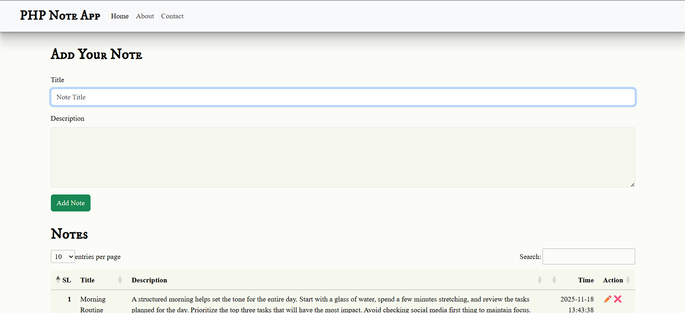
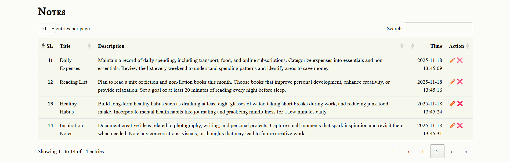

# 📒 PHP Notes App

A simple and elegant **CRUD-based Notes Application** built using **PHP**, **MySQL**, **Bootstrap 5**, and **DataTables**.
This app allows users to **add**, **edit**, **delete**, and **view** notes with timestamps in a clean UI.

---

## 🚀 Features

* ✨ Add new notes
* ✏️ Edit existing notes using Bootstrap modal
* ❌ Delete notes with confirmation
* 📅 Automatic timestamp for each note
* 📄 Display notes in a sortable & searchable DataTable
* 🎨 Clean UI using Bootstrap
* ⚡ AJAX-free CRUD using pure PHP + MySQL

---

## 🛠️ Tech Stack

* **Frontend:** HTML, CSS, Bootstrap 5, DataTables
* **Backend:** PHP
* **Database:** MySQL
* **Libraries:** jQuery, Bootstrap Modal

---

## 📦 Installation

### 1️⃣ Clone the repository

```bash
git clone https://github.com/Dipan46/PHP-Note-App.git
cd php-note-app
```

### 2️⃣ Configure Database

Create a MySQL database named:

```
phpnoteapp
```

Run the following SQL to create the table:

```sql
CREATE TABLE `notes` (
  `id` int(11) NOT NULL AUTO_INCREMENT,
  `title` varchar(255) NOT NULL,
  `description` text NOT NULL,
  `t_stamp` timestamp NOT NULL DEFAULT current_timestamp(),
  PRIMARY KEY (`id`)
);
```

### 3️⃣ Configure DB Connection

Update your database credentials inside `index.php`:

```php
$servername = "localhost";
$username = "root";
$password = "";
$database = "phpnoteapp";
```

### 4️⃣ Run the Project

Place the project folder inside:

```
htdocs (for XAMPP)
www (for WAMP)
```

Start Apache & MySQL → Open in browser:

```
http://localhost/php-note-app
```

---

## 📸 Screenshots




* Add Note Form
* Notes Table
* Edit Modal

---

## 📚 How It Works

### ➕ Add Note

Submitting the form sends POST data to insert into MySQL:

```php
$sql = "INSERT INTO `notes` (`title`, `description`) VALUES ('$title', '$description')";
```

### ✏️ Edit Note

Triggered by clicking the ✏️ icon → opens modal → updates:

```php
$sql = "UPDATE `notes` SET `title`='$title', `description`='$description' WHERE id='$sl'";
```

### ❌ Delete Note

Triggered by clicking ❌:

```php
$sql = "DELETE FROM notes WHERE id = '$sl'";
```

---

## 📂 Project Structure

```
├── index.php
├── styles.css
├── README.md
├── /assets (optional)
```

---

## 🙌 Author

**Dipan46**
Feel free to ⭐ the repository if you find it useful!

---

If you'd like, I can also:
✅ Generate a **LICENSE** file
✅ Create a **project logo**
✅ Add GitHub badges
Just tell me!

